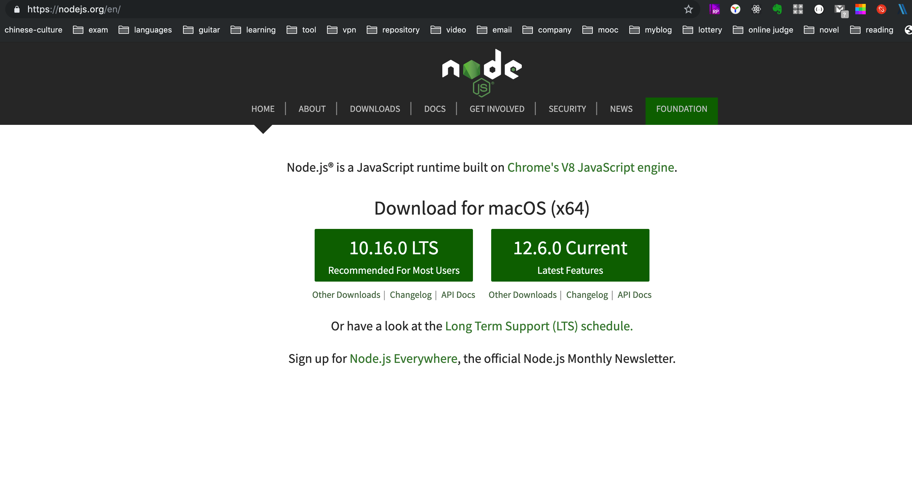
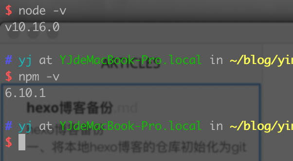
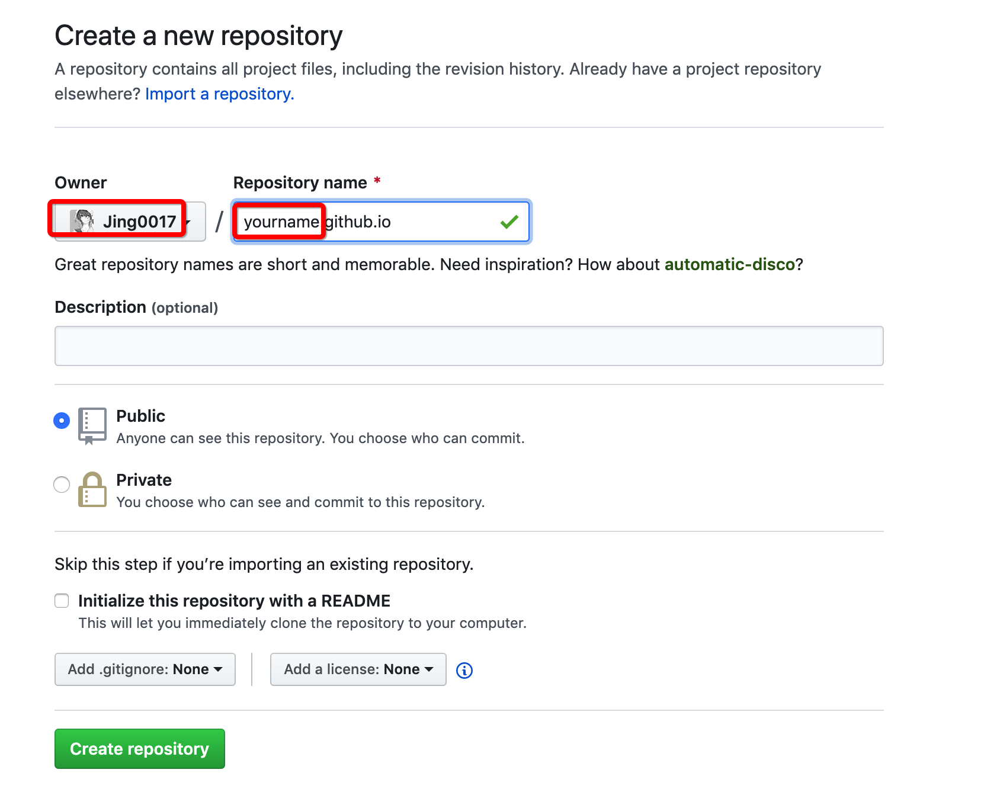
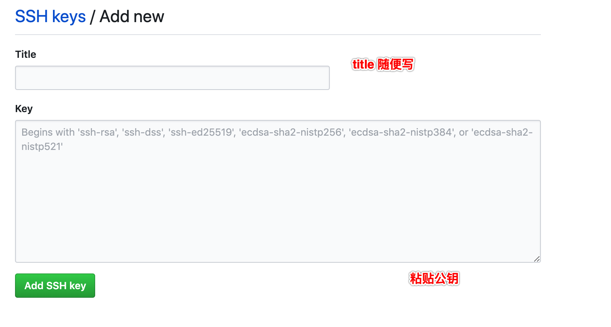
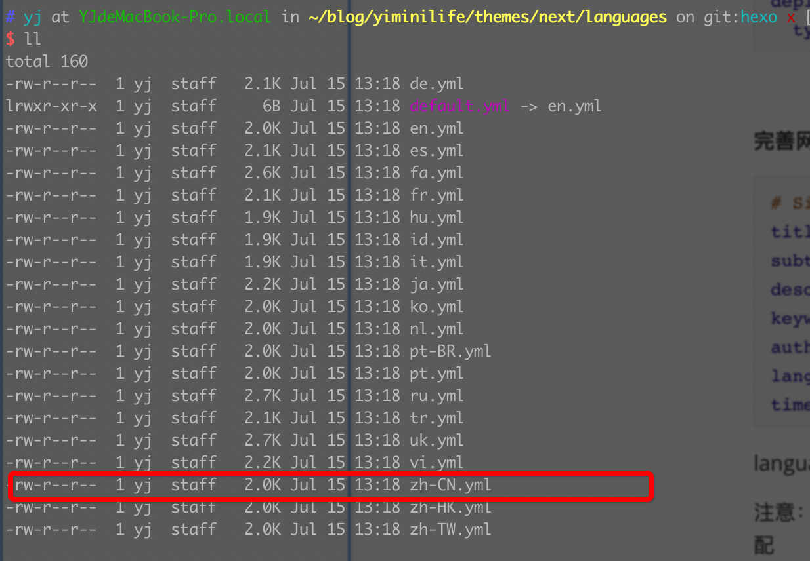
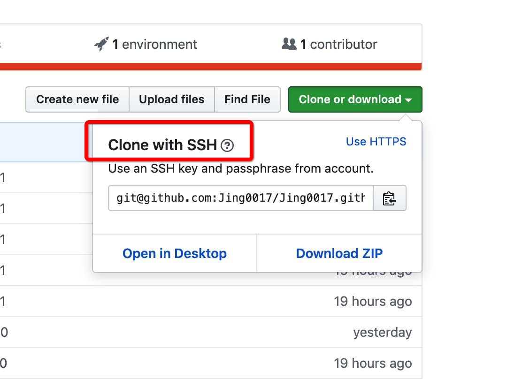
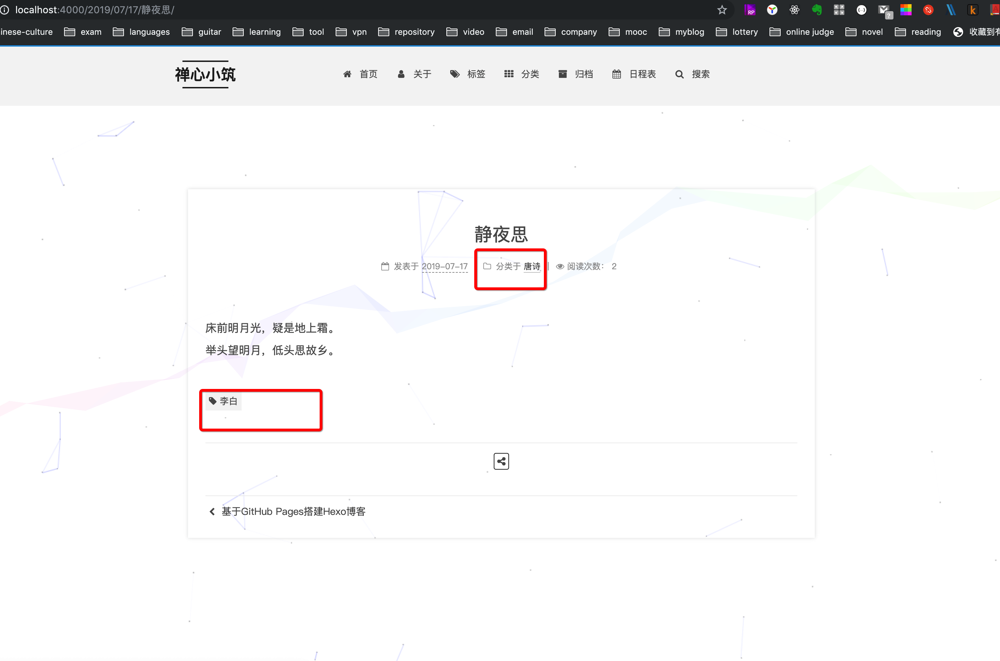
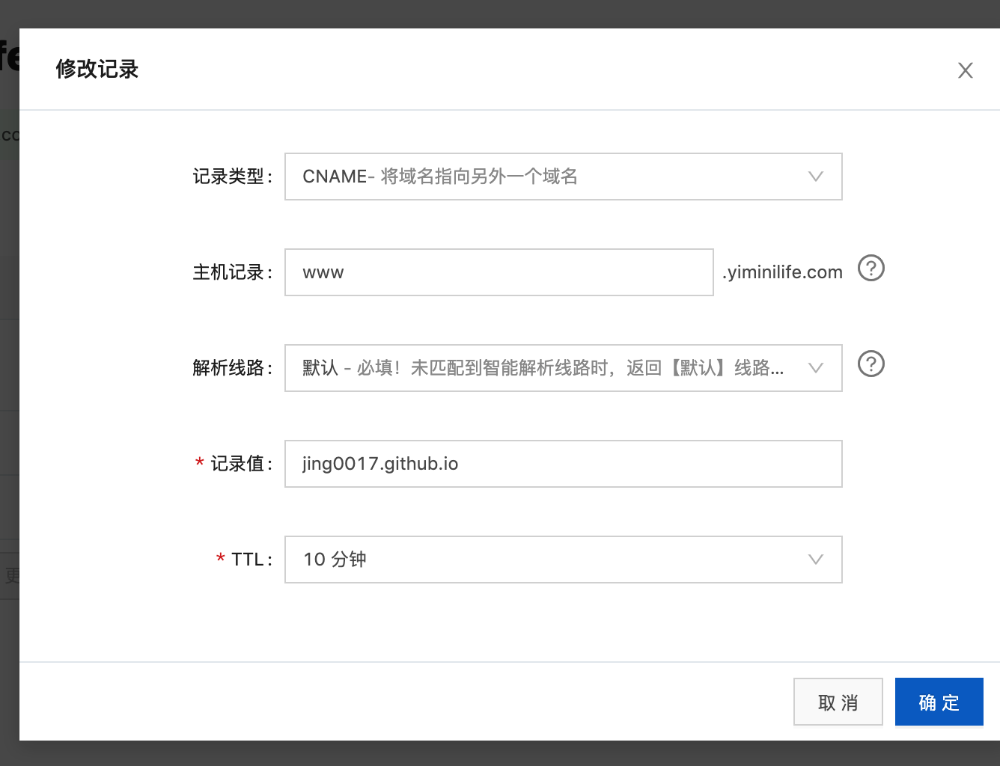
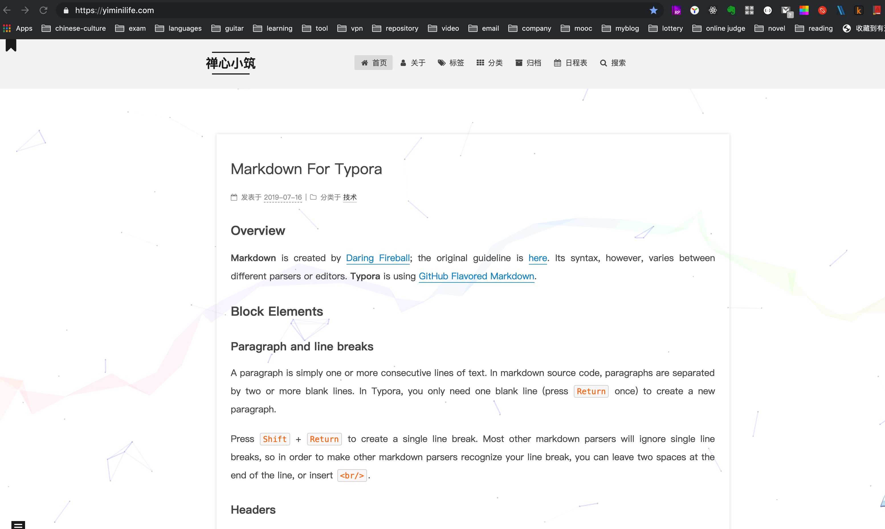

## 介绍

Hexo 是一个快速、简洁且高效的博客框架。Hexo 使用 [Markdown](http://daringfireball.net/projects/markdown/)（或其他渲染引擎）解析文章，在几秒内，即可利用靓丽的主题生成静态网页。

## 准备工作

### 安装Git版本控制软件

访问git[官方下载页面](http://git-scm.com/downloads)下载对应终端的git安装包，笔者使用的是macbook,所以下载Mac OS X 版本。下载页面如下图所示，点击下载对应终端的git安装包即可。


安装完毕在命令终端输入git，出现如下提示表示git安装成功。window用户可以使用git bash。


### 安装nodejs

访问[nodejs官网](https://nodejs.org)下载lts版本的安装包，笔者访问时的版本为10.16.0，直接点击下载安装即可。



安装完毕，在命令行输入`node -v`和`npm -v`出现版本信息，表示node安装成功。



### 创建github仓库

#### 创建repository

访问[github](https://github.com/)。如果没有账号，请先注册。注册完毕，进入个人中心页面，点击左侧边栏的`new`按钮，进入创建仓库界面。输入仓库名称，**yourname.github.io**。点击`Create repository`完成仓库创建。

注意：

1. __yourname__要和你的github用户名一致，笔者这里__yourname__为**Jing0017**。
2. 仓库后缀必需为__.github.io__结尾。

请务必遵循这俩个条件，否则后续访问会出现404错误。



#### 设置repository的Github Pages

完成创建后，点击`Settings`，滚动下拉至Github Pages配置模块，配置`Source`，下拉框选择master分支。如果master branch为灰色，请先按照`Code`Tab页的教程生成README.md文件，然后在回来设置Github Pages。


#### 生成ssh秘钥

为方便后续访问，选择ssh方式克隆仓库，免去每次提交时的用户和密码验证。

在终端（Terminal）输入：

```bash
$ ssh-keygen -t rsa -C "Github的注册邮箱地址"
```

遇到提示请按`Enter`，等待秘钥生成完毕，会得到两个文件**id_rsa**和**id_rsa.pub**，用文本编辑器打开**id_rsa.pub**复制里面内容。访问[这里](https://github.com/settings/ssh)，点击 `New SSH key`，将复制的内容粘贴至文本框中。最后点击`Add SSH key`。




## 安装配置hexo

做完上述准备工作，终于迎来了我们的主角hexo。

具体安装步骤，可以参考[官方文档](https://hexo.io/zh-cn/docs/)。不想移步的请继续往下看。

### 下载安装hexo

#### 选定博客在本地存放的路径

```bash
$ cd <your path> 
```

**强调**：强烈建议**不要** 选择需要管理员权限才能创建文件（夹）的文件夹。

#### 安装hexo-cli

```bash
$ npm install -g hexo-cli
```

等待安装完毕，在命令行输入

```bash
$ hexo
```

若出现下图，说明hexo安装成功：


#### 初始化博客

```bash
$ hexo init <folder>  // 建立一个博客文件夹，并初始化博客，<folder>为文件夹的名称，可以随便起名字
$ cd <folder>
$ npm install // 根据package.json的dependencies配置安装所有的依赖包
```


#### 配置_config.yml

初始化博客之后，我们可以看到项目的基本目录结构：

```html
.
├── _config.yml
├── package.json
├── scaffolds
├── source
|   ├── _drafts
|   └── _posts
└── themes

```

`_config.yml`里修改博客的基础配置。可以参考[官方文档](https://hexo.io/zh-cn/docs/configuration)。下面我们具体看一下`_config.yml`文件全貌。

```yaml
# Hexo Configuration
## Docs: https://hexo.io/docs/configuration.html
## Source: https://github.com/hexojs/hexo/

# Site
title: # The title of your website
subtitle: # The subtitle of your website
description: # The description of your website
author: # Your name
language: # The language of your website
timezone: 

# URL
## If your site is put in a subdirectory, set url as 'http://yoursite.com/child' and root as '/child/'
url: http://yoursite.com/child
root: /
permalink: :year/:month/:day/:title/
permalink_defaults:

# Directory
source_dir: source
public_dir: public
tag_dir: tags
archive_dir: archives
category_dir: categories
code_dir: downloads/code
i18n_dir: :lang
skip_render:

# Writing
new_post_name: :title.md # File name of new posts
default_layout: post
titlecase: false # Transform title into titlecase
external_link: true # Open external links in new tab
filename_case: 0
render_drafts: false
post_asset_folder: false
relative_link: false
future: true
highlight:
  enable: true
  line_number: true
  auto_detect: false
  tab_replace:

# Category & Tag
default_category: uncategorized
category_map:
tag_map:

# Date / Time format
## Hexo uses Moment.js to parse and display date
## You can customize the date format as defined in
## http://momentjs.com/docs/#/displaying/format/
date_format: YYYY-MM-DD
time_format: HH:mm:ss

# Pagination
## Set per_page to 0 to disable pagination
per_page: 10
pagination_dir: page

# Extensions
## Plugins: https://hexo.io/plugins/
## Themes: https://hexo.io/themes/
theme: landscape

# Deployment
## Docs: https://hexo.io/docs/deployment.html
deploy:
  type: 
```


##### 完善网站信息(Site)

```yaml
# Site
title: 禅心小筑
subtitle: 随遇而安   
description: 菩提本无树，明镜亦非台。本来无一物，何处惹尘埃。
keywords: 技术 生活 修行 求道。
author: 随风
language: zh-CN
timezone: Asia/Shanghai
```

language和timezone的配置，详细可参考[语言规范](https://en.wikipedia.org/wiki/List_of_ISO_639-1_codes)和[时区规范](https://en.wikipedia.org/wiki/List_of_tz_database_time_zones)。

注意：language字段配置的zh-CN 必需和相关主题文件夹下 `/themes/next/languages`里面的国际化文件相匹配，否则配置将不生效，显示默认英文配置。




##### 配置主题

hexo的默认主题是 `landscape`，参看[这里](https://hexo.io/themes/)可以选择自己心仪的主题，笔者这里选择的是[next](https://theme-next.org/)，安装教程可参看[这里](https://github.com/theme-next/hexo-theme-next)。简要步骤如下：

```bash
$ cd <folder> 
$ git clone https://github.com/theme-next/hexo-theme-next themes/next
```

然后在_config.yml中配置：

```yaml
theme: next
```

##### 配置部署（Deploy）

```yaml
deploy:
  type: git
  repo: git@github.com:Jing0017/Jing0017.github.io.git
  branch: master
```

此处repo配置为准备工作中我们创建的仓库。选择使用ssh方式克隆。branch选择master分支，和github page的设置相对应。



至此我们完成了hexo的安装与配置。


## 发表第一篇文章

### 建立分类

命令终端输入：

```bash
$ hexo new page "categories"
```

在/source/categories目录下找到`index.md`文件打开写入如下内容：

```markdown
---
title: 文章分类
date: 2019-07-15 11:49:33
type: "categories"
---
```

### 建立标签

同理

```bash
$ hexo new page "tags"
```

在/source/tags目录下找到`index.md`文件打开写入如下内容：

```markdown
---
title: 标签
date: 2019-07-15 11:49:20
type: "tags"
---
```

### 新建一篇文章

#### 新建文章并完成写作

```bash
$ hexo new "静夜思"
```

在/source/_post目录下找到 `静夜思.md`文件打开写入如下内容：


详细解释如下：

```markdown
title: 静夜思 //文章的标题
date: 2019-07-17 16:54:51
categories: 唐诗 //注意:之后有空格，将文章划分到唐诗的分类中
tags: 李白 //给文章打上李白的标签


床前明月光，疑是地上霜。
举头望明月，低头思故乡。

```


#### 本地访问博客

##### markdown生成html

```bash
$ hexo generate //简写 hexo g
```

此时发现文件目录多了public文件夹，此文件夹下是根据/source/_post/目录下的所有markdown文件生成的html，css，js等静态文件。

##### 启动本地服务

```bash
$ hexo server // 简写 hexo s
```


根据提示访问http://localhost:4000。

发现主页新增了一篇静夜思的文章，切分类为唐诗，标签为李白。




笔者这里已经对主题进行了优化，所以和next的默认样式出入较大。


#### 通过Github Page 访问博客

执行hexo 部署命令，将生成的静态文件推送至我们的github仓库(yourname.github.io)。

```bash
$ hexo deploy //简写 hexo d
```

然后直接访问https://yourname.github.io即可。


#### 通过域名访问hexo博客

###### 购置域名

从各大域名提供商购置个人域名，笔者之前在阿里万网购置过域名，此处省略域名购置流程。可以自行百度。

###### Github Pages 配置域名


在仓库的`Settings`tab页中找到GitHub Pages 将`Custom domain` 设置为自己的域名。此时可以看到`Code`tab

页中会生成一个CNAME文件，保存着我们的域名信息。

###### 域名配置DNS解析

新增俩条域名解析




记录类型为**CNAME**，主机记录分别为**@**和**www**,记录值填**yourname.github.io**。等待域名解析生效。

域名解析生效后，直接访问**http://你的域名**即可访问hexo博客。效果如下：




**注意：**  CNAME文件在下次 hexo deploy的时候就消失了，需要重新创建，这样就很繁琐。

网上推荐的解决方法我比较推荐新增hexo-generator-cname插件实现永久保留。

具体操作如下：

在博客根目录下（source 同级目录）

```bash
$ npm install hexo-generator-cname --save //下载hexo-generator-cname库并将依赖写入package.json
```


在_config.yml 找到Plugins的注释，在其下方增加:

```yaml
Plugins:
- hexo-generator-cname
```


:smile:感谢你看到了最后，至此我们完成了hexo博客的搭建。